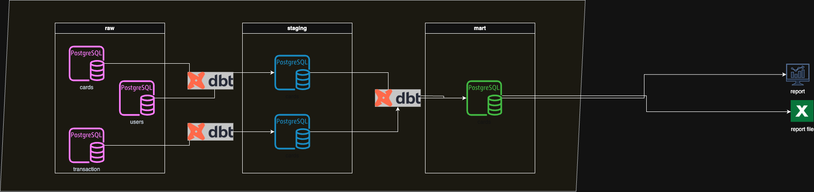

# dbt-learn
Learn how to use dbt and try to create a simple project for datawarehousing

Pre-requisite 
1. Tools 
    * dbt
    * Postgresdb
2. Diagram
    * Used PostgreSQL as the database, storing raw data in the raw schema (raw layer). The data in the raw layer is processed into a data warehouse by cleansing and standardizing it, then loading it into dimension and fact tables in the staging layer. The data mart is created using the processed data from the data warehouse. All transformations are performed using dbt as the tool for data transformation.

    